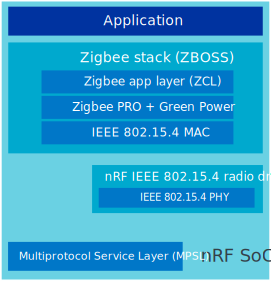
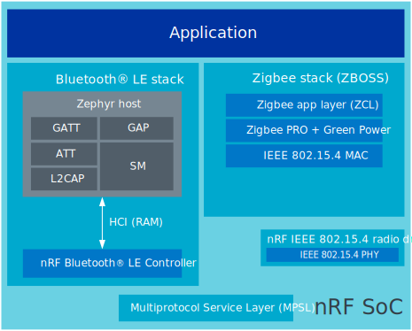
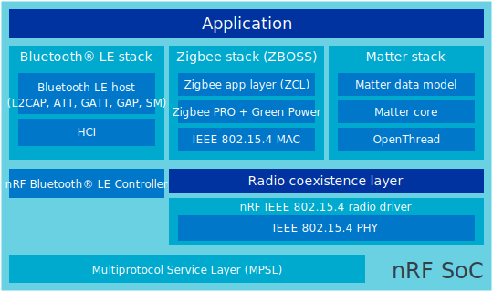
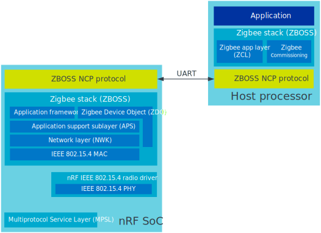

.. _ug_zigbee_architectures:

Architectures
#############

.. contents::
   :local:
   :depth: 2

This page describes the platform designs that are possible with the Zigbee stack on Nordic Semiconductor devices.

The designs are described from the least to the most complex, that is from simple applications that consist of a single chip running single or multiple protocols to scenarios in which the nRF SoC acts as a network co-processor when the application is running on a much more powerful host processor.

.. _ug_zigbee_platform_design_soc:

System-on-Chip designs
**********************

The single-chip solution has a combined RFIC (the IEEE 802.15.4 in case of Zigbee) and processor.
Both the Zigbee stack and the application layer run on the local processor.
The ZBOSS stack communicates directly with the nRF 802.15.4 radio driver, bypassing the Zephyr networking (L2) layer.

This design has the following advantages:

* Lowest cost
* Lowest power consumption
* Lowest complexity

It also has the following disadvantages:

* For some uses, the nRF SoC's MCU can be too slow to handle both the application and the network stack load.
* The application and the network stack share flash and RAM space.
  This leaves less resources for the application.
* Dual-bank DFU or an external flash is needed to update the firmware.

Single-chip, single protocol (SoC)
==================================

In this design, the application layer and the stack run on the same processor.
The application uses the :ref:`zigbee_zboss` APIs directly.

This is the design most commonly used for End Devices and Routers.

   Zigbee-only architecture on nRF54L Series and nRF52840 devices

This platform design is suitable for the following development kits:

.. include:: /includes/device_table_single_multi.txt

Single-chip, multiprotocol (SoC)
================================

With the nRF devices supporting multiple wireless technologies, including IEEE 802.15.4 and Bluetooth® Low Energy (Bluetooth LE), the application layer and the Zigbee and Bluetooth LE stack run on the same chip.

This design has the following advantages:

* It allows to run Zigbee and Bluetooth LE simultaneously on a single chip, which reduces the overall BOM cost.

It also has the following disadvantages:

* Bluetooth LE activity can degradate the connectivity on Zigbee if not implemented with efficiency in mind.

   Multiprotocol Zigbee and Bluetooth LE architecture on nRF54L Series and nRF52840 devices

For more information, see `Multiprotocol support`_ in the |NCS| documentation and :ref:`zigbee_light_switch_sample_nus`.

This platform design is suitable for the following development kit:

.. include:: /includes/device_table_single_multi.txt

.. _ug_zigbee_platform_design_matter:

Single-chip, combined Matter + Zigbee (SoC)
===========================================

In this design, the Zigbee (ZBOSS) and Matter over Thread (OpenThread) stacks run on the same nRF SoC and share the single 802.15.4 radio through a coexistence layer, while a `SoftDevice Controller`_ instance handles Bluetooth LE (CHIPoBLE) commissioning.
Radio ownership is time-separated and persisted across reboots: the device boots as a Zigbee node, advertises for Matter commissioning over Bluetooth LE in parallel, and hands the 802.15.4 radio over to OpenThread once the first Matter CASE session is established.

This design has the following advantages:

* The same firmware image can start as a Zigbee device and migrate to a Matter device after Matter commissioning, without reflashing the node.
* Commissioning over Bluetooth LE (CHIPoBLE) runs concurrently with normal Zigbee operation, so no dedicated Matter build or separate commissioning device is needed on the field.
* Persistent protocol state makes Matter-commissioned devices skip the Zigbee stack entirely on subsequent boots, removing the Zigbee footprint from the hot path.

It also has the following disadvantages:

* The 802.15.4 radio is used by one stack at a time, so Zigbee operation pauses once the device switches to Matter.
  Returning to Zigbee is done through a Matter factory reset, which also clears the Matter commissioning data.
* The combined build has a larger memory footprint than either stack alone, and the partition layout and resource sizing are tuned for the supported target.
* Sharing the 802.15.4 radio between two stacks requires some additional orchestration (the ``zigbee_matter_coexistence`` library and the ``nrf_802154_callbacks_dispatcher``), which is not needed in Zigbee-only or Matter-only builds.

   Combined Matter + Zigbee architecture on a single SoC

This platform design is currently provided as a proof of concept and is supported on the following development kit only:

* nRF54LM20 DK (``nrf54lm20dk/nrf54lm20a/cpuapp``)

.. _ug_zigbee_platform_design_ncp:

Co-processor designs
********************

In co-processor designs, the application runs on one processor (the host processor) and communicates with another processor that provides the radio interface.
In these designs, the more powerful processor (host) interacts with the Zigbee network through a connectivity device, for example a Nordic Semiconductor's device with the Zigbee interface.

The co-processor designs can be used when a device requires additional functionalities or more compute power than what Nordic Semiconductor's devices have to offer, but the more powerful processor does not have a suitable radio interface.
The split stack architectures are most commonly used to design a Zigbee gateway, but sometimes also for complex Zigbee Routers or Zigbee End Devices.

.. _ug_zigbee_platform_design_ncp_details:

Network Co-Processor (NCP)
==========================

In this design, the host processor runs the Zigbee application layer (ZCL) and the Zigbee commissioning logic.
The connectivity device (nRF SoC) runs the :ref:`NCP application <zigbee_ncp_sample>` that contains lower parts of the Zigbee stack (802.15.4 PHY/MAC and the Zigbee PRO network layer), as well as provides commands to execute BDB commissioning primitives.
The host processor communicates with the NCP through a serial interface (UART).

The NCP design has the following advantages:

* Cost-optimized solution - uses the resources on the more powerful processor.
* The NCP device does not require the support for the dual-bank DFU.
  It can be upgraded by the host processor.
* Access to the :ref:`full feature set of ZBOSS <zigbee_about>`.
* Lower memory footprint on the connectivity side (as compared with single-SoC Zigbee applications).

It also has the following disadvantages:

* The host part of the stack must be built and run for every individual host processor in use.
  However, Nordic Semiconductor provides reference implementation for Linux-based platforms in the ZBOSS NCP Host package.

   Split Zigbee architecture

The |addon| for the |NCS| includes the :ref:`ug_zigbee_tools_ncp_host` tool.
|zigbee_ncp_package|

The tool is available for download as a standalone :file:`zip` package using the following link:

  * `ZBOSS NCP Host`_ (|zigbee_ncp_package_version|)

|zigbee_ncp_package_more_info|

This platform design is suitable for the following development kits:

.. include:: /includes/device_table_ncp.txt
