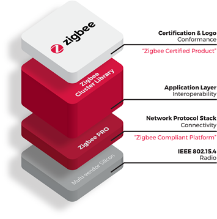

.. _zboss_certification:

ZBOSS library certification
###########################

.. contents::
   :local:
   :depth: 2

Zigbee ZBOSS R23 libraries in the |addon| for the |NCS| are always tested in-house by Nordic Semiconductor to conform to Zigbee Pro R23 test specification.
However, these libraries are only periodically verified by external test service provider and granted Zigbee Compliant Platform certification by Connectivity Standards Alliance.

   Zigbee certification levels

Certification levels
********************

The certification is based on CSA's `Zigbee certification policy`_, which distinguishes the following levels of certification:

* Compliant Platform
* Certified Product

The certification guarantees that a platform or product will work and will interoperate with other compliant platforms or certified products, respectively.

Nordic Semiconductor provides the Zigbee Compliant Platform.
You can use this platform as the building block for your Zigbee Certified Product, which is conformant with the ZCL and BDB standard.

Certification IDs
*****************

Check the compatibility matrices for your device to find the latest certification ID entries (CIDs) for each supported combination of the Zigbee R23 add-on version and Nordic Semiconductor SoCs:

* `Zigbee CIDs for nRF54L15`_
* `Zigbee CIDs for nRF54L10`_
* `Zigbee CIDs for nRF54L05`_
* `Zigbee CIDs for nRF5340`_
* `Zigbee CIDs for nRF52840`_
* `Zigbee CIDs for nRF52833`_
