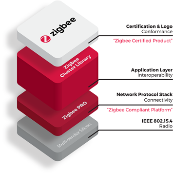

.. _zboss_certification:

ZBOSS library certification
###########################

.. contents::
   :local:
   :depth: 2

Zigbee ZBOSS R23 libraries in the |addon| for the |NCS| are always tested in-house by Nordic Semiconductor to conform to Zigbee Pro R23 test specification.
However, these libraries are only periodically verified by external test service provider and granted Zigbee Compliant Platform certification by Connectivity Standards Alliance.

   Zigbee certification levels

Certification levels
********************

The certification is based on CSA's `Zigbee certification policy`_, which distinguishes the following levels of certification:

* Compliant Platform
* Certified Product

The certification guarantees that a platform or product will work and will interoperate with other compliant platforms or certified products, respectively.

Nordic Semiconductor provides the Zigbee Compliant Platform.
You can use this platform as the building block for your Zigbee Certified Product, which is conformant with the ZCL and BDB standard.

.. _zboss_certification_r22_mode:

R22 behavior mode for Zigbee 3.0 product certification
******************************************************

This page explains why Zigbee 3.0 products built on the Zigbee PRO R23 and R23.2 platforms must run the core stack in R22 behavior mode during certification, and how the |addon| applies this mode by default.

.. include:: /includes/zigbee_r22_certification_note.txt

CSA certification policy for Zigbee 3.0 products on R23 platforms
=================================================================

The Zigbee PRO R23 and R23.2 platform in the |addon| is certified in native R23 mode.
MAC-layer certification does not depend on the R22 or R23 runtime mode.

For Zigbee 3.0 product certification, CSA requires the R23 core to run in R22 behavior mode.
As of late 2025, the PRO Core TSG determined that Zigbee 3.0 devices based on the R23 stack must operate the core in R22 mode (originally defined for Test Harness use in the R23 Platform Test Specification).
The same requirement applies to both R23 and R23.2 specification versions.

R22 behavior mode is therefore the default in the |addon|.
The add-on applies it automatically through the Zigbee PRO core runtime behavior Kconfig choice (``CONFIG_ZIGBEE_PRO_CORE_BEHAVIOR_R22``).
See :ref:`zigbee_ug_r22_behavior` for configuration details.

When certifying a Zigbee 3.0 product, declare R23.2 as the core version.
The certification procedure and test set are unchanged.
Only the application must run in R22 mode.

R22 mode and full Zigbee PRO R22 conformance
============================================

On ZBOSS 4.x and 5.x, R22 behavior mode satisfies CSA requirements for Zigbee 3.0 device certification, but does not provide full conformance to the Zigbee PRO Core R22 specification.

R22 behavior mode has the following known deviations from the Zigbee PRO Core R22 specification:

* The APS fragmentation window is always set to 1, while R22 allows larger values.
* Automatic PAN ID conflict resolution is not performed. 
  The application is notified when a conflict is detected (R22 requires automatic resolution).

After enabling R22 mode, DSR recommends running your product application through ZUTH certification tests before submitting for product certification.

Certification IDs
*****************

Check the compatibility matrices for your device to find the latest certification ID entries (CIDs) for each supported combination of the Zigbee R23 add-on version and Nordic Semiconductor SoCs:

* `Zigbee CIDs for nRF54L15`_
* `Zigbee CIDs for nRF54L10`_
* `Zigbee CIDs for nRF54L05`_
* `Zigbee CIDs for nRF5340`_
* `Zigbee CIDs for nRF52840`_
* `Zigbee CIDs for nRF52833`_
